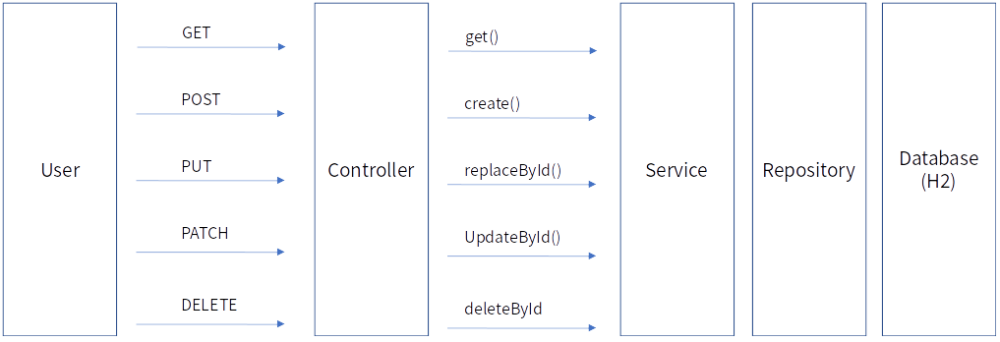

# Simply - Creating Simple RESTFUL API

Simply를 이용해 Springboot 기반의 Restful API를 만들어 보고 H2 Database를 통해 저장한다.

- Jpa기반의 'User' entity를 구현하고 관리하는 Serviceable Component의 구현
- Serviceable Component를 이용한 Restful API의 구현

## 1. 사전 준비

- 15분
- 개발도구
- JDK 11+
- Maven 또는 Gradle

## 2. Architecture

본 예제에서 사용되는 기술은 다음과 같다.
- Java
- JPA
- Simply(Serviceable, Controllable)
- Spring Boot
- H2

본 예제를 통해 구현할 것은 다음과 같다.
- User Entity
- User Repository
- User Service
- User Controller


Quick Starter는 User Entity를 만들어 해당 Entity를 관리하는 Restful API를 자동화 한다. Controller를 통해 Endpoint를 제공하며 이는 Service를 통해 JPA
Repository에 연결된 Database에 저장 된다.

## 3. Source Code

본 Quick Starter의 Source Code는  [다운로드]<https://github.com/potatowhite/simply-quickstart/archive/main.zip> 를 통해 얻을 수 있다.

## 4. 프로젝트 시작하기

Gradle을 통해 다음의 Library를 Import한다.
```groovy
repositories {
    mavenCentral()
}
```

### 4.1 Springboot 에서 제공하는 starter, jpa, web 을 import 한다.

```groovy
implementation 'org.springframework.boot:spring-boot-starter'
implementation 'org.springframework.boot:spring-boot-starter-data-jpa'
implementation 'org.springframework.boot:spring-boot-starter-web'
runtimeOnly 'com.h2database:h2'
compileOnly 'org.projectlombok:lombok'
annotationProcessor 'org.projectlombok:lombok'
testImplementation 'org.springframework.boot:spring-boot-starter-test'
```


### 4.2 Gradle : Simply에서 사용하는 Library를 import 한다.

```groovy
implementation 'io.easywalk:simply-common:0.0.1.RELEASE'
implementation 'io.easywalk:simply-serviceable:0.0.1.RELEASE'
implementation 'io.easywalk:simply-controllable:0.0.1.RELEASE'
```

### 4.3 Maven: Simply에서 사용하는 Library를 import 한다.
```xml
<dependency>
  <groupId>io.easywalk</groupId>
  <artifactId>simply-common</artifactId>
  <version>0.0.1.RELEASE</version>
</dependency>
<dependency>
    <groupId>io.easywalk</groupId>
    <artifactId>simply-serviceable</artifactId>
    <version>0.0.1.RELEASE</version>
</dependency>
<dependency>
    <groupId>io.easywalk</groupId>
    <artifactId>simply-controllable</artifactId>
    <version>0.0.1.RELEASE</version>
</dependency>
```


## 5. User Entity 생성하기

간단한 User를 할 Entity를 정의 한다. 속성으로는 객체를 구분할 id, name, email 을 부여하며, 연락처 정보는 별도의 Table에 저장하기 위해 ElementCollection을 사용했다. 이는
Demo를 위한 내용으로 필요에 따라 구성할 수 있다.

```java

@Getter
@Setter
@NoArgsConstructor
@ToString
@Entity
public class User {

    @Id
    @GeneratedValue(strategy = GenerationType.AUTO)
    private Long   id;
    private String name;

    @Column(unique = true)
    private String email;

    @ElementCollection
    @CollectionTable(
            name = "contacts",
            joinColumns = @JoinColumn(name = "user_id")
    )
    private List<Contact> contacts;

    private LocalDateTime createdDate;

    @PrePersist
    private void init() {
        createdDate = LocalDateTime.now();
    }
}
```

User Entity에서 사용할 연락처 정보인 Contact 등을 구현한다.

```java

@Getter
@Setter
@NoArgsConstructor
@AllArgsConstructor
@Embeddable
public class Contact {
    @Enumerated(EnumType.STRING)
    private Type   type;
    private String contact;

    enum Type {
        HOME, OFFICE, MOBILE
    }
}
```

## 6. User Service 생성하기

Simply는 JPA Repository를 사용하고 있다. 따라서 Service를 만들기 위해 Repostiry 를 먼저 생성해야한다.

```java
public interface UserRepository extends JpaRepository<User, Long> {
}
```

이제 Simply의 기본이 되는 Service를 AbstractServiceable를 상속받가 생성하자. AbstractServiceable는 Java의 Generic으로 구현되어있으며 관리하고자할 'User'
Entity와 id Type인 Long을 정의한다.  
Serivceable 내부에서는 JpaRepository를 사용하고 있기 때문에 생성사를 통해 Repository 주입하고 있다.

```java

@Service
public class UserService extends AbstractServiceable<User, Long> {
    protected UserService(UserRepository repository) {
        super(repository);
    }
}
```

### 6.1 UserService 기능 살펴보기

UserService는 Simply에서 정의한 SimplySpec의 기능을 제공한다.

```java
public interface SimplySpec<T, ID> {
    T create(T createForm) throws Throwable;

    T replaceById(ID id, T replace) throws Throwable;

    T updateById(ID id, Map<String, Object> fields) throws Throwable;

    T get(ID id) throws Throwable;

    List<T> getAll() throws Throwable;

    void deleteById(ID id) throws Throwable;

    void delete(T entity) throws Throwable;
}
```

사용법은 아래와 같다.

```java
userService.create(..);
userService.replaceById(..);
userService.updateById(..);
userService.deleteById(..);
userService.get(..);
userService.getAll(..);
```

## 7. User Controller 구현

UserController는 'User' 엔티티를 외부에 전달하기 위해 Restful API 를 제공한다.

### 7.1 Controller의 생성하기

UserController를 생성하기 위해서는 AbstractControllable Class를 상속받는다. Serviceable과 마찬가지로 관리하고자 할 엔티티인 User아 User의 ID Type인 Long을
정의한다.

```java

@RestController
@SimplyControllableResponse
@RequestMapping("users")
public class UserController extends AbstractControllable<User, Long> {
    public UserController(UserService service) {
        super(service);
    }
}
```

### 7.2 Logging 및 Exception Handling

Controller를 생성 할 때 일반적인 Spring Framework 기반의 Annotation 외 @SimplyControllableResponse를 볼 수 있다. 이는 ControllerAdvice를 통해
적절한 Exception Handling 을 위해 제공된다.

Logging 및 Exception Handling 을 위해 Simply에서 제공하는 Component를 사용해야한다. 이를 위해 Simply는 @EnableSimplyControllable annotation을
제공한다.

```java

@EnableSimplyControllable // Logging 및 Exception Handling
@SpringBootApplication
public class SimplyQuickstartApplication {

    public static void main(String[] args) {
        SpringApplication.run(SimplyQuickstartApplication.class, args);
    }

}
```

실제 Logging 내용
```http request
 INFO 22881 --- [nio-8080-exec-7] i.e.s.controllable.SimplyLoggingAspect   : [REQ] PUT /users/1 Param:null, RequestBody:User(id=null, name=테스터, email=test02@example.com, contacts=[io.easywalk.simplyquickstart.user.entities.Contact@689c83af, io.easywalk.simplyquickstart.user.entities.Contact@548ac7b, io.easywalk.simplyquickstart.user.entities.Contact@d8a45f9], createdDate=null)
 INFO 22881 --- [nio-8080-exec-7] i.e.s.controllable.SimplyLoggingAspect   : [RES] PUT /users/1 Param:null, Response:200 User(id=1, name=테스터, email=test02@example.com, contacts=[io.easywalk.simplyquickstart.user.entities.Contact@56ad6797, io.easywalk.simplyquickstart.user.entities.Contact@6e6b43a7, io.easywalk.simplyquickstart.user.entities.Contact@1634de73], createdDate=null)
```

### 7.3 Resful API 응답코드

각 예외사항 별 Response Code는 아래와 같다.

#### Controllable의 처리완료 Response Code

|Method|ResponseCode|Reason|Comment|
|---|---|---|---|
|POST|201 Created|성공|
|PUT|200 OK|성공|
|PATCH|200 OK|성공|
|DELETE|204 No Contents|성공||

#### Controllable의 처리실패 Response Code

|Method|ResponseCode|Reason|Comment|
|---|---|---|---|
|POST|400 Bad Request|실패|규격 오류|
|POST|409 Conflict|실패|이미 존재함|
|PUT|404 Not Found|실패|컨텐츠 미존재|
|PATCH|404 No Contents|실패|컨텐츠 미존재|
|PATCH|400 Bad Request|실패|규격 오류|
|undefined|500 Internal Server Error|실패|

## 8. 테스트 방법

junit 등을 통해 자동화 할 수 있겠지만 Quick Starter에서는 간단하게 http 호출을 통해 테스트해보자 해당 테스트는 intellij 또는 Visual Studio Code(+plugin:
RestClient) 를 통해 실행할 수 있다.

```http request
### POST
POST localhost:8080/users
Content-Type: application/json

{
  "name": "테스터",
  "email": "test01@example.com",
  "contacts": [
    {
      "type": "HOME",
      "contact": "+82012340000"
    },
    {
      "type": "OFFICE",
      "contact": "+82012341111"
    }
  ]
}

### PUT
PUT localhost:8080/users/1
Content-Type: application/json

{
  "name": "테스터",
  "email": "test02@example.com",
  "contacts": [
    {
      "type": "HOME",
      "contact": "+82012340000"
    },
    {
      "type": "OFFICE",
      "contact": "+82012341111"
    }
  ]
}


### PATCH
PATCH localhost:8080/users/1
Content-Type: application/json

{
  "contacts": [
    {
      "type": "HOME",
      "contact": "+82012343333"
    }
  ]
}

### DELETE
DELETE localhost:8080/users/1
Content-Type: application/json

### GET
GET localhost:8080/users/1


### GET ALL
GET localhost:8080/users
```